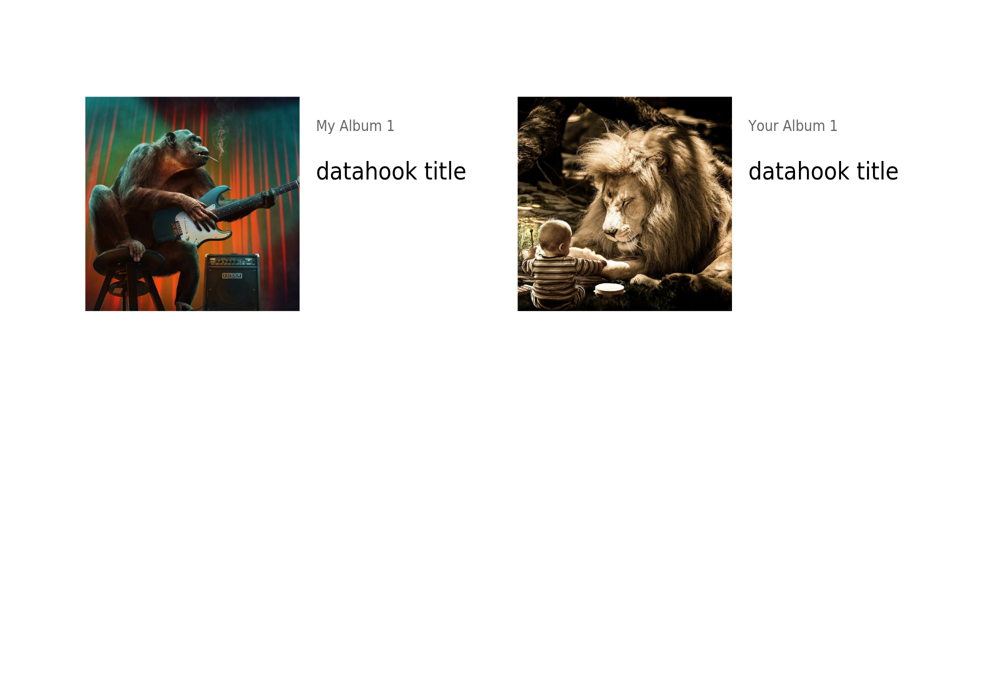

# labelmaker

`labelmaker` generates PDF files from HTML-Templates based on the [TWIG](https://twig.symfony.com/) template engine. `labelmaker` was created to build labels for the well known [RPi-Jukebox-RFID](https://github.com/MiczFlor/RPi-Jukebox-RFID) and during development I found out, that the tool has much more potential.

## Documentation
The [full documentation is available here](https://pilabor.com/labelmaker) 

## Previews

- [CSV Template](https://github.com/sandreas/labelmaker/blob/main/samples/use-csv-data-uri/use-csv-data-uri.pdf)
- [Media Template Phoniebox](https://github.com/sandreas/labelmaker/blob/main/samples/use-media-data-uri/use-media-data-uri-hook.pdf)

## Development notes
Due to a change in `mpdf` that I made to support `PHAR` usage, currently it is not possible to build `labelmaker`. The release `v8.0.14` should contain this fix. I will update the dependencies as soon as possible.
